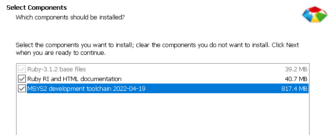
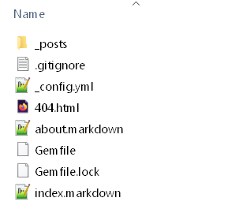
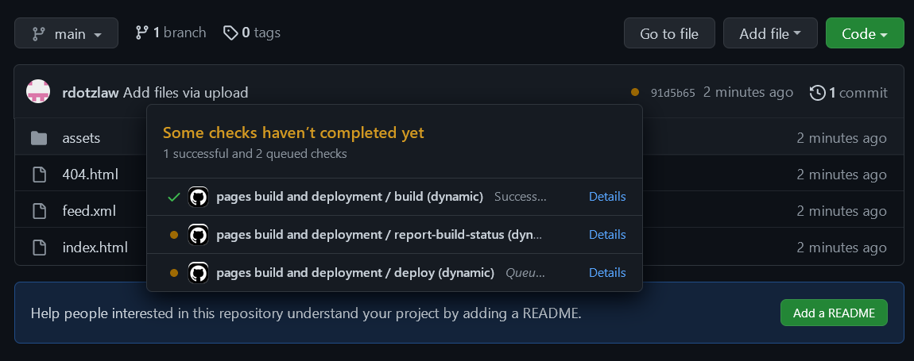
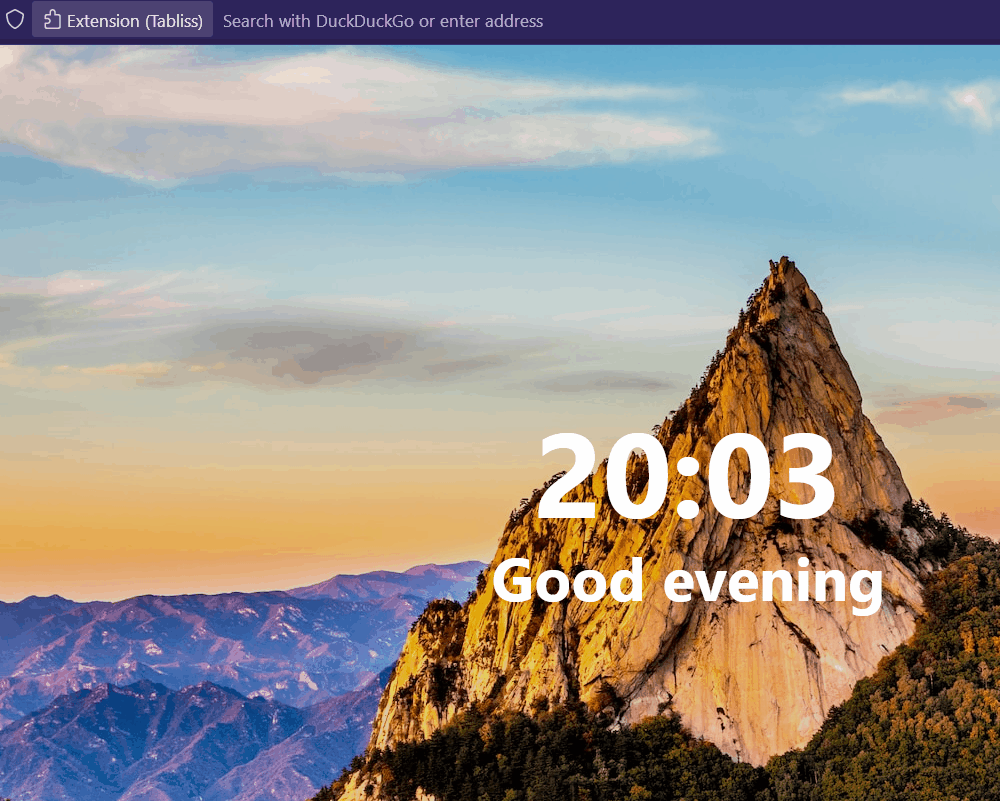

# How to Host a Resume on Github Pages

### Purpose

The purpose of this README is to teach you how to host a Markdown resume on Github Pages using a Jekyll as a static site generator. 
Additionally, the steps taken will be related to the general principles of technical communication as described in Andrew Etter's book: *Modern Technical Writing*.

### Prerequisites

 - A resume formatted in Markdown  
 - A Github account  
 - A basic understanding of how to use command line  
 
### Instructions

#### Creating the Website
If you want to host your resume on Github Pages, the first thing you'll need is a website to host. 
The easiest way to do this is with a static site generator, which will automatically create a website from a Markdown file and allow for easy modification.
These instructions will go over how to do that using Jekyll, 
however, if you plan on using another static site generator, you can skip to the section: **Hosting the Website**, to see how to host a website with Github Pages.

> Etter's book recomends using a static site generator, like Jekyll, to quickly and efficiently create basic websites from Markdown files.

1. Installing Jekyll

	a. Install the latest version of Ruby, with the dev-kit, from the [Ruby website](https://rubyinstaller.org/downloads/).
	
	Simply download and run the installer, but be sure to include the MSYS2 developement toolchain once you get to the following screen. 
	
	b. Install the latest version of RubyGems, and follow the instructions, from the [RubyGems website](https://rubygems.org/pages/download)
	
	c. Install the latest version of Jekyll by running the following command in the command line:
	```sh
	gem install jekyll bundler
	```

Now that you have Jekyll installed, you can use it to create websites from Markdown files and host them locally.

2. Creating and running a new website

	a. Open the command line and move to a directory where you want Jekyll to create your website
	b. Run the following command (without square brackets) and Jekyll will create a new directory with the given name
	```sh
	jekyll new [NAME]
	```
	c. The new directory created should look similar to this: 
	
	
	
	Now you are able to run the website at any point by running the following command in the recently created directory:
	```sh
	bundle exec jekyll serve
	```
	The website can be found at the address given in the output of the previous command. By default, the address is the local host on port 4000 by default, [here](http://localhost:4000).

Of course, the default website generated by Jekyll wont serve much purpose, so you'd want to modify it.

3. Modifying the website

	a. The first step to modifying the website is changing the config. Open up **_config.yml** in a text editor of your choice.
	Inside are several global variables of the site, such as the website's title, some contact details, and a site description. Feel free to change these to whatever you want, but keeping it professional and using your own contact infomation is recomended.
		- Be sure to change the ```url``` field in the config to "[Github_Username].github.io"
	
	b. By default, Jekyll creates a site that looks like a blog, which isn't necessary for the purpose of hosting a resume.
	Go into the **_posts** directory and delete everything in it. Additionally, delete the **about.Markdown** and **index.Markdown** files in the root directory.
	
	c. Now you need to copy and paste your Markdown formatted resume into the root directory and change it's name to **index.Markdown**.
	
	d. Finally, copy and paste the following line of Markdown at the top of the newly renamed **index.Markdown**:
	```
	---
	layout: home
	---
	```
	The website will now feature your resume as the home page. 


#### Hosting the Website

Now that you've created the website, you just need to host it on Github Pages.

> Etter's book advises using a distributed version control software, like Github.
> The use of distributed version control allows you to make changes that will be reflected across all devices accessing the file.


1. To set up the repository that will store you website, head to [this page on Github](https://github.com/new).
2. Make the name of the repository "[Github_Username].github.io", which will be the address of your hosted website, and make sure your repository is public.
3. From there click on "upload an existing file" at the bottom of the blue *Quick Start* box.
4. In your file explorer, navigate to the **_site** folder in your Jekyll website directory.
	- Note: The **_site** directory will only appear if you've ran the ```bundle exec jekyll serve``` command at least once.
5. Copy everything from the **_site** directory and upload it to your Github repository and then commit your changes at the bottom of the page.
6. Github will host your uploaded **index.html** on Github Pages shortly, once you refresh the page and no longer see Github trying to build and deploy your website


Your website can be accessed by heading the the URL: "[Github_Username].github.io"




### More Resources

 - [Tutorial for Github Flavoured Markdown](https://docs.github.com/en/get-started/writing-on-github/getting-started-with-writing-and-formatting-on-github)
 - [Link to the book: *Modern Technical Writing*](https://www.amazon.ca/Modern-Technical-Writing-Introduction-Documentation-ebook/dp/B01A2QL9SS/ref=sr_1_1)
 - [Resources to change the theme of your website](https://jekyllrb.com/docs/themes/)
 
### Authors and Acknowledgements

 - Nicke Manarin for the screen recording software, [ScreenToGif](https://github.com/NickeManarin/ScreenToGif).
 - Mostafa Hamed, Victoria Kogan, and Aqil Mukhi for editing.
 - Jekyll for the [minima theme](https://github.com/jekyll/minima). 

### FAQ


Why would I want to host my resume on a website?

- By hosting your resume on a website, you remove the need to send a resume file with any job applications, and any updates made to your resume visible to any prospective employers without requiring you to send an updated copy. 

Why is Markdown better than a word processor?

- Markdown is better than a word processor because it is easy to read for both a human and a computer. This allows Markdown files to be simple to edit for humans, but still used in computer software or automation.
